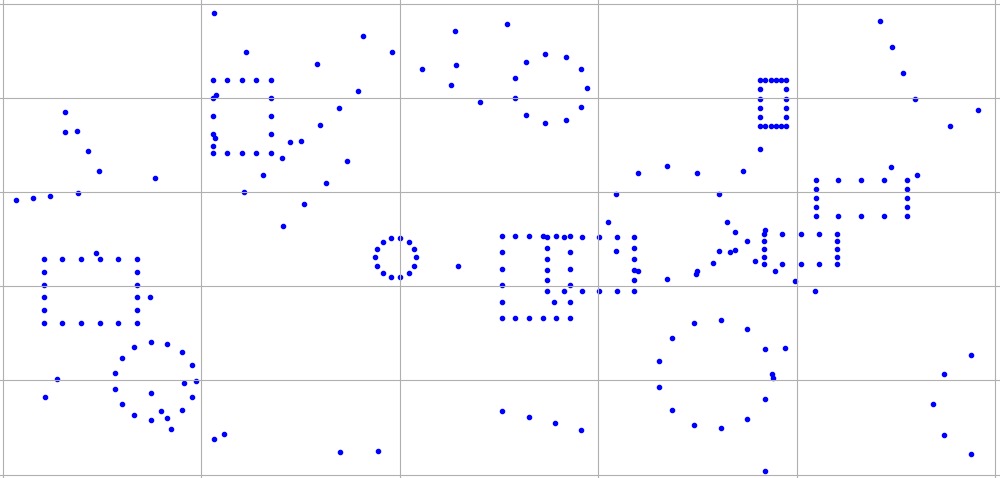
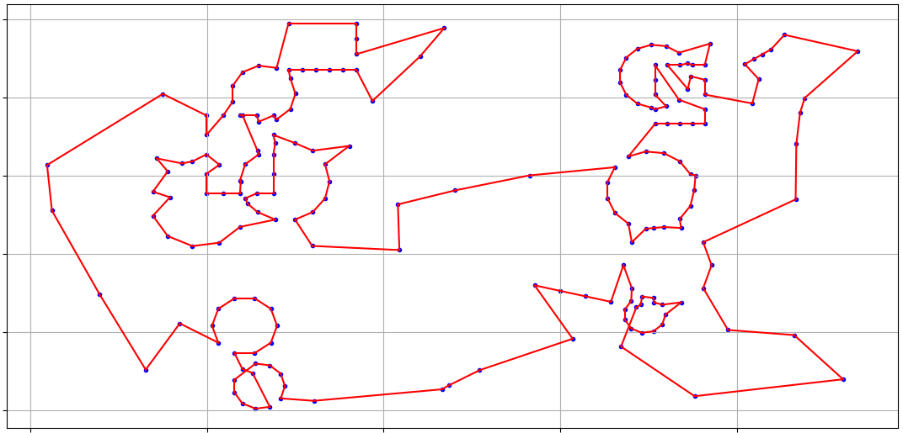
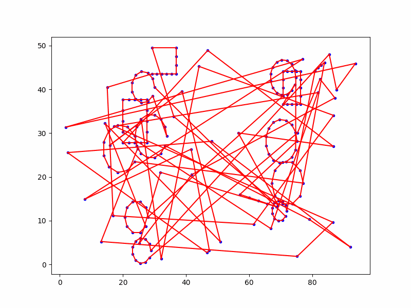
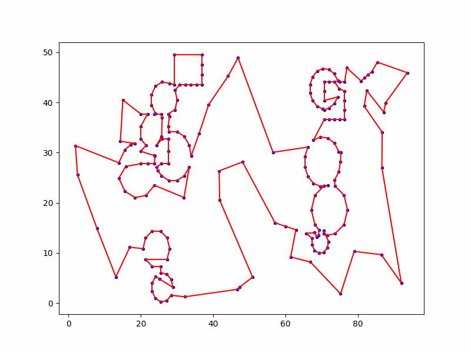

# Methods and Models for Combinatorial Optimization Project

## Abstract
A company produces boards with holes used to build electric panels. Boards are positioned over a
machine and a drill moves over the board, stops at the desired positions and makes the holes. Once a
board is drilled, a new board is positioned and the process is iterated many times. Given the position
of the holes on the board, the company asks us to determine the hole sequence that minimizes the
total drilling time, taking into account that the time needed for making an hole is the same and
constant for all the holes.

## Solvers
3 different solvers has been implemented:
- `CplexSolver` which solves the problem as MILP optimization problem;
- `TwoOptSolver` which solves the problem with a 2-opt neighbourhood search;
- `TabuSearchSolver` which solves the problem with a tabu-search built on top of the 2-opt neighbourhood search.

## Input Generation
Input are generated in order to be coherent with problem's abstract.

## Solutions
Solutions found by different solvers on an instance with 200 nodes.

### MILP solution
An example of a suboptimal solution found by `CplexSolver`:
- Execution time: 45 min
- Solution value: 618.972

[//]: # ()

### 2-Opt Solution
- Execution time: 202 ms
- Solution value: 657.699

### Tabu Search solution
- Execution time: 26505 ms
- Solution value: 647.64

